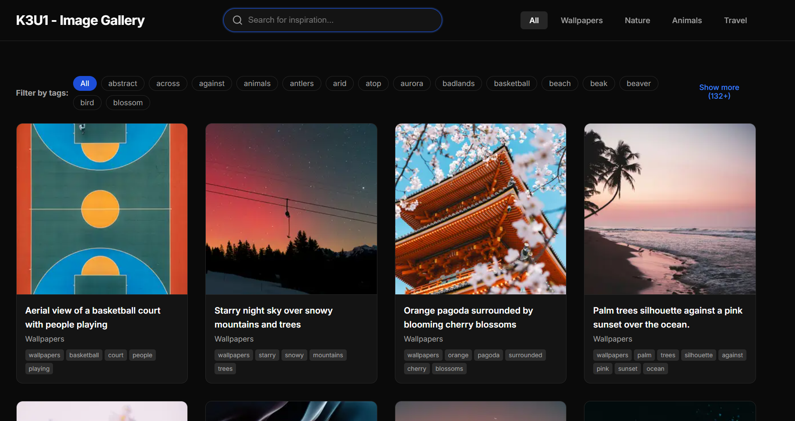
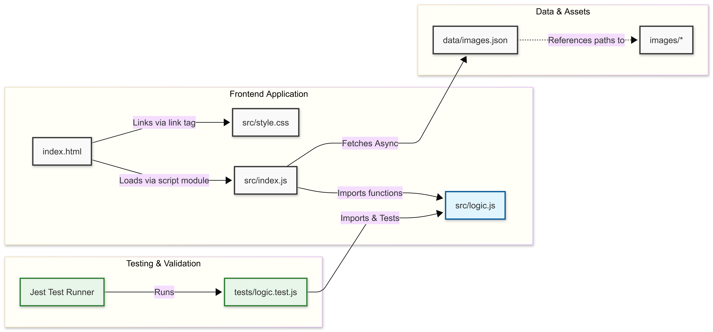
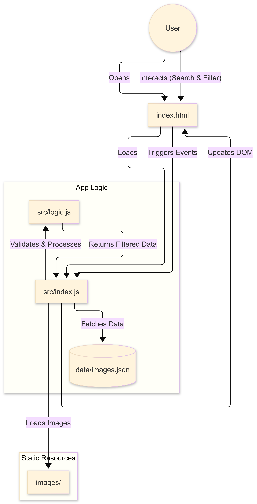
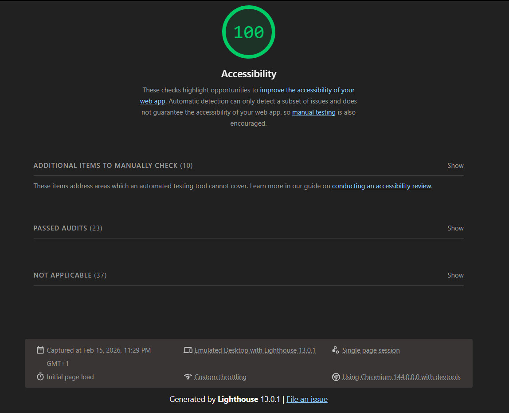
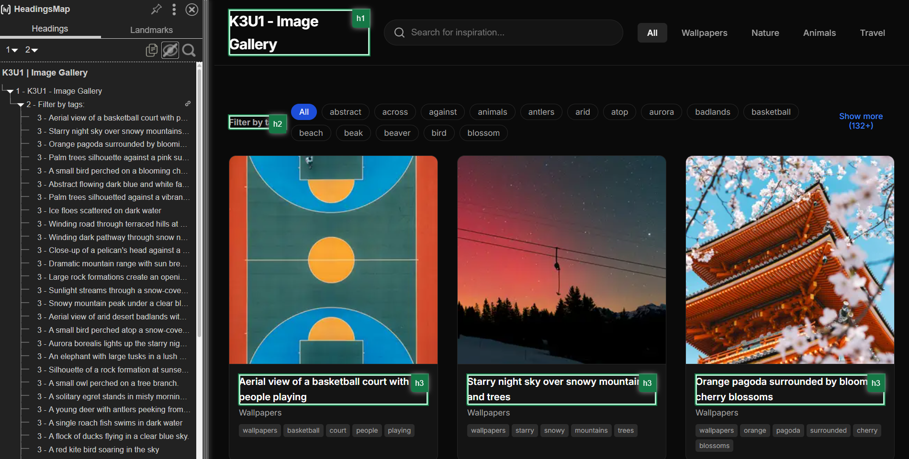
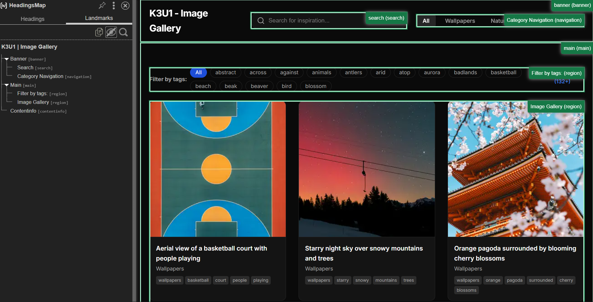

# K3U1 - Image Gallery



## Overview

Accessible image gallery application. Built with performance and user experience, it features category filtering, tag search, and a responsive lightbox view.

## Features

-   **Categorized Gallery**: Filter images by categories like Wallpapers, Nature, Animals, and Travel.
-   **Tag Filtering**: Refine your view by selecting specific tags.
-   **Search**: Instantly find images by keywords.
-   **Lightbox View**: Immersive full-screen image viewing with keyboard navigation.
-   **Performance**: Optimized with lazy loading for fast initial page loads.
-   **Accessibility**: inclusive design with ARIA support and keyboard navigability.

## Setup & Usage

1.  **Install dependencies:**
    ```bash
    npm install
    ```

2.  **Start the development server:**
    ```bash
    npm start
    ```
    The application will launch in your default browser.

3.  **Run tests:**
    ```bash
    npm test
    ```

4.  **Run test coverage:**
    ```bash
    npm run test:coverage
    ```


## Architecture

### Technical Diagram

*Diagram illustrating the application's code structure and flow.*

### User Action Flow

*Diagram illustrating the user interaction flow.*

## Accessibility & SEO

### Lighthouse Score

*Current Lighthouse accessibility and performance metrics.*

### Headings Structure

*HeadingsMap audit showing the semantic heading structure.*

### Landmarks

*HeadingsMap audit showing the page landmarks.*
